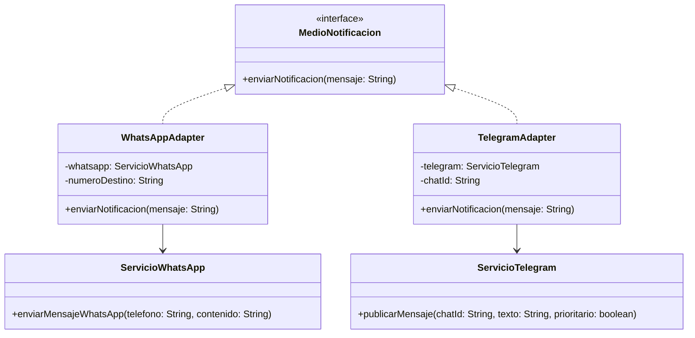
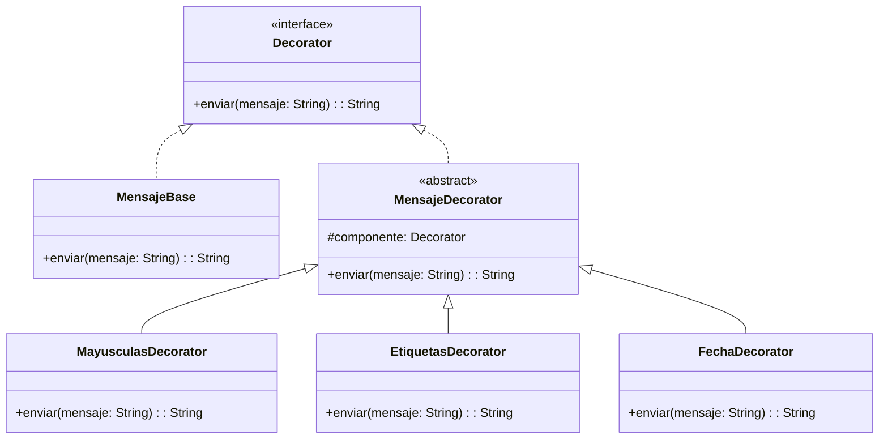
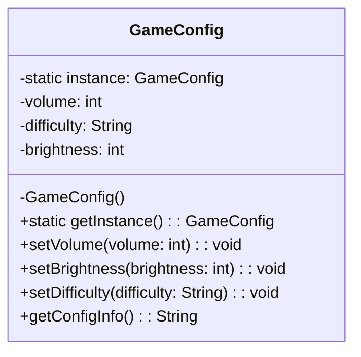
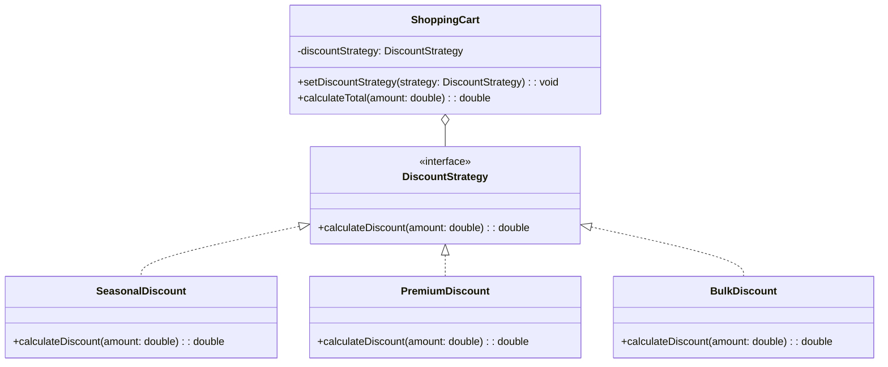
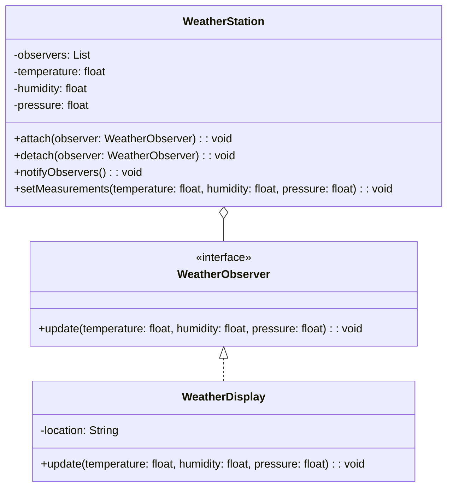

# Patrones de Diseño - Ejemplos de Implementación

Este repositorio contiene implementaciones prácticas de varios patrones de diseño en Java. A continuación se presenta un resumen de cada patrón implementado y su diagrama de clases correspondiente.

## 1. Patrón Adapter

Permite la adaptación de interfaces incompatibles entre servicios de mensajería (WhatsApp y Telegram).

## 2. Patrón Decorator

Permite añadir funcionalidades adicionales a mensajes de forma dinámica.

## 3. Patrón Singleton

Garantiza una única instancia de configuración del juego.

## 4. Patrón Strategy

Permite intercambiar algoritmos de descuento en tiempo de ejecución.

## 5. Patrón Observer

Implementa un sistema de notificaciones para actualizaciones meteorológicas.

